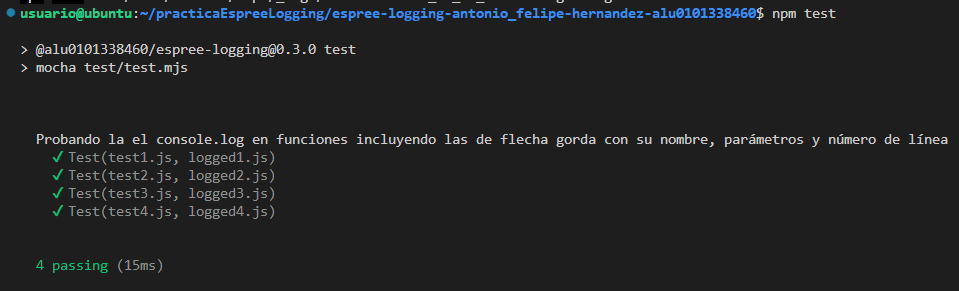
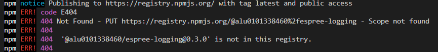

[](https://classroom.github.com/open-in-codespaces?assignment_repo_id=10298666)
# Práctica Espree logging

## Resumen de lo aprendido sobre logging-espree.js

El archivo logging.js utiliza la librería Espree para analizar el código fuente de un archivo de entrada. El código de entrada se analiza para identificar todas las funciones declaradas y expresiones de función flecha. Una vez que se identifican estas funciones, se agrega un __console.log__ a cada función antes de su cuerpo de función. Este se genera utilizando la información de la función, como su nombre, parámetros y número de línea. El código de registro es un mensaje de que se muestra en la consola, que indica que se ha ingresado en una función específica del archivo de entrada
El depurador de google permite establecer breakpoints y controlar el flujo de ejecución de un programa así como las características que suelen tener los depuradores. Se abre con f12.

## Indicar los valores de los argumentos

Se ha modificado el código de `logging-espree.js` para que el log también indique los valores de los argumentos que se pasaron a la función. 
Ejemplo:

```javascript
function foo(a, b) {
  var x = 'blah';
  var y = (function (z) {
    return z+3;
  })(2);
}
foo(1, 'wut', 3);
```

```javascript
function foo(a, b) {
    console.log(`Entering foo(${ a }, ${ b })`);
    var x = 'blah';
    var y = function (z) {
        console.log(`Entering <anonymous function>(${ z })`);
        return z + 3;
    }(2);
}
foo(1, 'wut', 3);
```

## CLI con [Commander.js](https://www.npmjs.com/package/commander)

El ejecutable `bin/log.js` se ha modificado para que acepte argumentos de línea de comandos. Se ha utilizado la librería [Commander.js](https://www.npmjs.com/package/commander) para implementar la CLI.


## Se han añadido scripts


## Reto 1: Soportar funciones flecha

Para esto, se ha modificado el código y se ha usado una versión ecmaVersion que soporte las funciones flecha. En este caso, se ha usado la versión 12:
```javascript
const ast = espree.parse(code, { ecmaVersion: 12, loc: true });
```

## Reto 2: Añadir el número de línea

Como en el se ve en la línea de código del reto anterior, se usa `loc` para obtener la información de la línea:
  
```javascript
const lineN = node.loc.start.line;
```

## Tests and Covering

Se han añadido tests para comprobar que el código funciona correctamente. Para ello, se ha usado la librería [Mocha](https://mochajs.org/). Para comprobar la cobertura de los tests, se ha usado la librería [nyc](https://www.npmjs.com/package/nyc).
Para ejecutar los tests y comprobar la cobertura, se ha usado el siguiente comando:

```bash
npm run test
npm run cov
```

Consideré que un test era suficiente para comprobar todas las funcionalidades:



## Se ha intentado publicar el paquete npm

Se ha pasado por muchos problemas para crear la cuenta de npm e introducir los comandos, pero no he conseguido publicar el paquete porque el scope no existe





